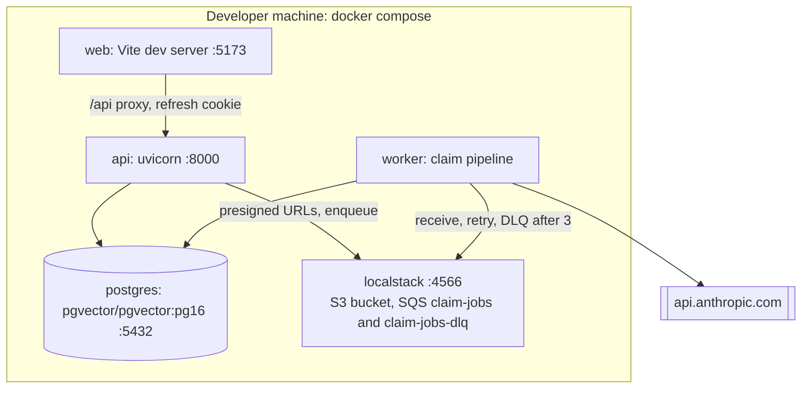
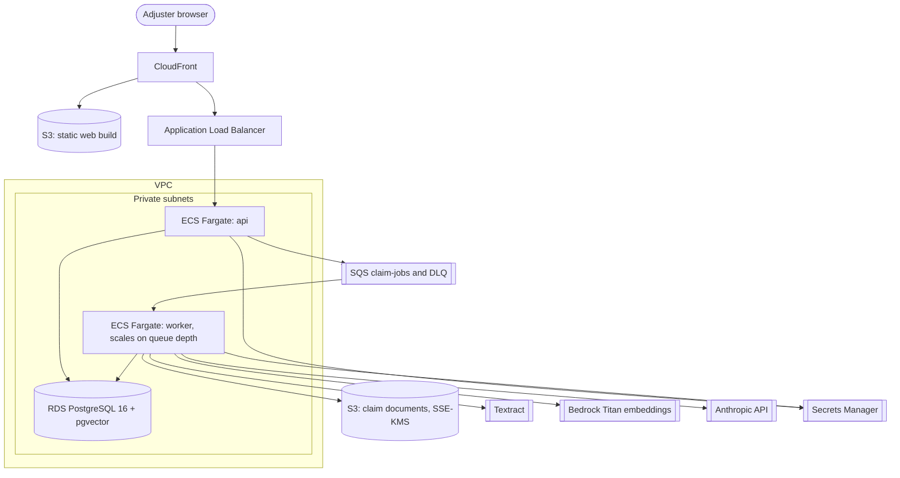

# Deployment views

## Local development (Docker Compose)

```mermaid
flowchart TB
    subgraph Laptop["Developer machine: docker compose"]
        web["web: Vite dev server :5173"]
        api["api: uvicorn :8000"]
        worker["worker: claim pipeline"]
        pg[("postgres: pgvector/pgvector:pg16 :5432")]
        ls["localstack :4566<br/>S3 bucket, SQS claim-jobs and claim-jobs-dlq"]
    end
    anthropic[[api.anthropic.com]]

    web -->|"/api proxy, refresh cookie"| api
    api --> pg
    api -->|"presigned URLs, enqueue"| ls
    worker -->|"receive, retry, DLQ after 3"| ls
    worker --> pg
    worker --> anthropic
```

## AWS target (Terraform in `infra/terraform`, not applied)

```mermaid
flowchart TB
    user([Adjuster browser]) --> cf[CloudFront]
    cf --> s3web[(S3: static web build)]
    cf --> alb[Application Load Balancer]

    subgraph VPC
        subgraph Private["Private subnets"]
            apisvc["ECS Fargate: api"]
            wsvc["ECS Fargate: worker, scales on queue depth"]
            rds[("RDS PostgreSQL 16 + pgvector")]
        end
    end

    alb --> apisvc
    apisvc --> rds
    apisvc --> sqs[[SQS claim-jobs and DLQ]]
    sqs --> wsvc
    wsvc --> rds
    wsvc --> docs[(S3: claim documents, SSE-KMS)]
    wsvc --> tex[[Textract]]
    wsvc --> bed[[Bedrock Titan embeddings]]
    wsvc --> anth[[Anthropic API]]
    apisvc --> sm[[Secrets Manager]]
    wsvc --> sm
```
