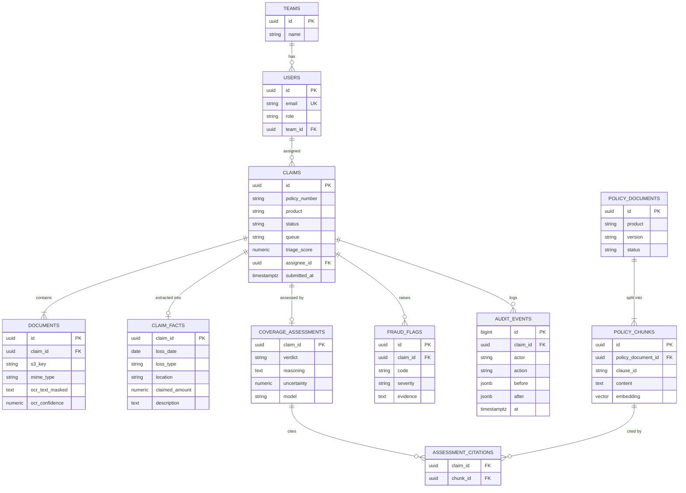

# Entity-relationship diagram

```mermaid
erDiagram
    TEAMS ||--o{ USERS : has
    USERS ||--o{ CLAIMS : "assigned"
    CLAIMS ||--|{ DOCUMENTS : contains
    CLAIMS ||--o| CLAIM_FACTS : "extracted into"
    CLAIMS ||--o| COVERAGE_ASSESSMENTS : "assessed by"
    CLAIMS ||--o{ FRAUD_FLAGS : raises
    CLAIMS ||--o{ AUDIT_EVENTS : logs
    POLICY_DOCUMENTS ||--|{ POLICY_CHUNKS : "split into"
    COVERAGE_ASSESSMENTS ||--o{ ASSESSMENT_CITATIONS : cites
    POLICY_CHUNKS ||--o{ ASSESSMENT_CITATIONS : "cited by"

    TEAMS {
        uuid id PK
        string name
    }
    USERS {
        uuid id PK
        string email UK
        string role
        uuid team_id FK
    }
    CLAIMS {
        uuid id PK
        string policy_number
        string product
        string status
        string queue
        numeric triage_score
        uuid assignee_id FK
        timestamptz submitted_at
    }
    DOCUMENTS {
        uuid id PK
        uuid claim_id FK
        string s3_key
        string mime_type
        text ocr_text_masked
        numeric ocr_confidence
    }
    CLAIM_FACTS {
        uuid claim_id PK
        date loss_date
        string loss_type
        string location
        numeric claimed_amount
        text description
    }
    COVERAGE_ASSESSMENTS {
        uuid claim_id PK
        string verdict
        text reasoning
        numeric uncertainty
        string model
    }
    ASSESSMENT_CITATIONS {
        uuid claim_id FK
        uuid chunk_id FK
    }
    FRAUD_FLAGS {
        uuid id PK
        uuid claim_id FK
        string code
        string severity
        text evidence
    }
    POLICY_DOCUMENTS {
        uuid id PK
        string product
        string version
        string status
    }
    POLICY_CHUNKS {
        uuid id PK
        uuid policy_document_id FK
        string clause_id
        text content
        vector embedding
    }
    AUDIT_EVENTS {
        bigint id PK
        uuid claim_id FK
        string actor
        string action
        jsonb before
        jsonb after
        timestamptz at
    }
```

`POLICY_CHUNKS.embedding` is `vector(1024)` with an HNSW index (`vector_cosine_ops`).
