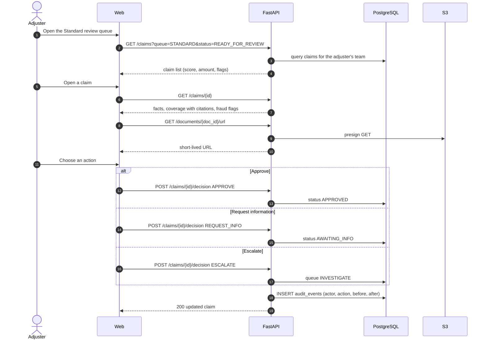

# Sequence: adjuster review

```mermaid
sequenceDiagram
    autonumber
    actor A as Adjuster
    participant UI as Web
    participant API as FastAPI
    participant DB as PostgreSQL
    participant S3 as S3

    A->>UI: Open the Standard review queue
    UI->>API: GET /claims?queue=STANDARD&status=READY_FOR_REVIEW
    API->>DB: query claims for the adjuster's team
    API-->>UI: claim list (score, amount, flags)
    A->>UI: Open a claim
    UI->>API: GET /claims/{id}
    API-->>UI: facts, coverage with citations, fraud flags
    UI->>API: GET /documents/{doc_id}/url
    API->>S3: presign GET
    API-->>UI: short-lived URL
    A->>UI: Choose an action

    alt Approve
        UI->>API: POST /claims/{id}/decision APPROVE
        API->>DB: status APPROVED
    else Request information
        UI->>API: POST /claims/{id}/decision REQUEST_INFO
        API->>DB: status AWAITING_INFO
    else Escalate
        UI->>API: POST /claims/{id}/decision ESCALATE
        API->>DB: queue INVESTIGATE
    end
    API->>DB: INSERT audit_events (actor, action, before, after)
    API-->>UI: 200 updated claim
```
