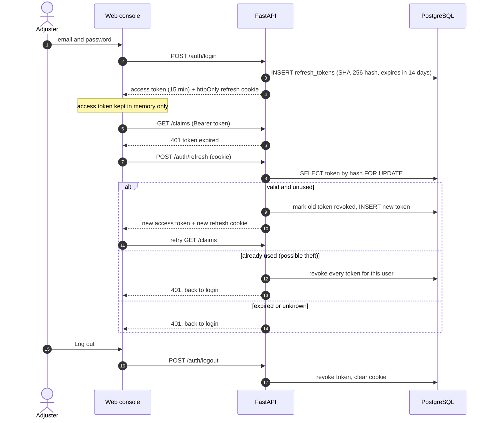

# Sequence: login and token refresh

```mermaid
sequenceDiagram
    autonumber
    actor A as Adjuster
    participant UI as Web console
    participant API as FastAPI
    participant DB as PostgreSQL

    A->>UI: email and password
    UI->>API: POST /auth/login
    API->>DB: INSERT refresh_tokens (SHA-256 hash, expires in 14 days)
    API-->>UI: access token (15 min) + httpOnly refresh cookie
    Note over UI: access token kept in memory only

    UI->>API: GET /claims (Bearer token)
    API-->>UI: 401 token expired
    UI->>API: POST /auth/refresh (cookie)
    API->>DB: SELECT token by hash FOR UPDATE
    alt valid and unused
        API->>DB: mark old token revoked, INSERT new token
        API-->>UI: new access token + new refresh cookie
        UI->>API: retry GET /claims
    else already used (possible theft)
        API->>DB: revoke every token for this user
        API-->>UI: 401, back to login
    else expired or unknown
        API-->>UI: 401, back to login
    end

    A->>UI: Log out
    UI->>API: POST /auth/logout
    API->>DB: revoke token, clear cookie
```
