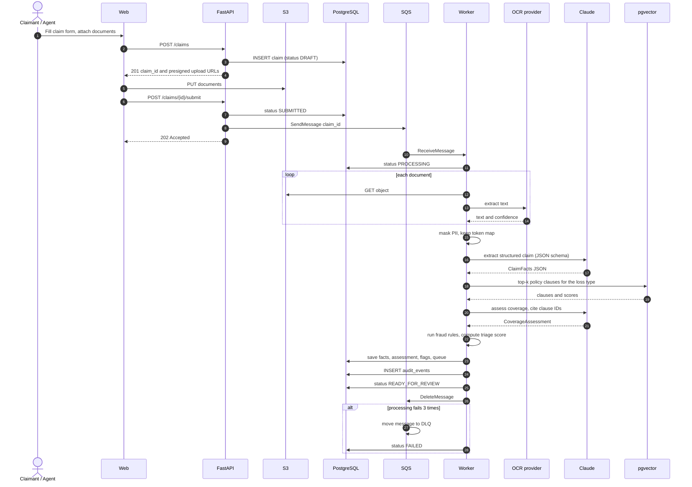

# Sequence: claim submission to triage

```mermaid
sequenceDiagram
    autonumber
    actor C as Claimant / Agent
    participant UI as Web
    participant API as FastAPI
    participant S3 as S3
    participant DB as PostgreSQL
    participant Q as SQS
    participant W as Worker
    participant OCR as OCR provider
    participant LLM as Claude
    participant VEC as pgvector

    C->>UI: Fill claim form, attach documents
    UI->>API: POST /claims
    API->>DB: INSERT claim (status DRAFT)
    API-->>UI: 201 claim_id and presigned upload URLs
    UI->>S3: PUT documents
    UI->>API: POST /claims/{id}/submit
    API->>DB: status SUBMITTED
    API->>Q: SendMessage claim_id
    API-->>UI: 202 Accepted

    Q->>W: ReceiveMessage
    W->>DB: status PROCESSING
    loop each document
        W->>S3: GET object
        W->>OCR: extract text
        OCR-->>W: text and confidence
    end
    W->>W: mask PII, keep token map
    W->>LLM: extract structured claim (JSON schema)
    LLM-->>W: ClaimFacts JSON
    W->>VEC: top-k policy clauses for the loss type
    VEC-->>W: clauses and scores
    W->>LLM: assess coverage, cite clause IDs
    LLM-->>W: CoverageAssessment
    W->>W: run fraud rules, compute triage score
    W->>DB: save facts, assessment, flags, queue
    W->>DB: INSERT audit_events
    W->>DB: status READY_FOR_REVIEW
    W->>Q: DeleteMessage

    alt processing fails 3 times
        Q->>Q: move message to DLQ
        W->>DB: status FAILED
    end
```
