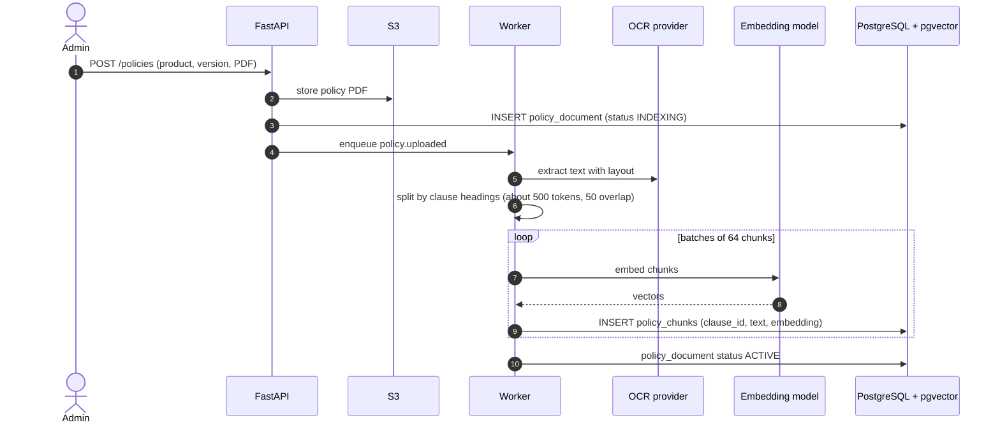

# Sequence: policy ingestion (RAG index)

```mermaid
sequenceDiagram
    autonumber
    actor Ad as Admin
    participant API as FastAPI
    participant S3 as S3
    participant W as Worker
    participant OCR as OCR provider
    participant EMB as Embedding model
    participant DB as PostgreSQL + pgvector

    Ad->>API: POST /policies (product, version, PDF)
    API->>S3: store policy PDF
    API->>DB: INSERT policy_document (status INDEXING)
    API->>W: enqueue policy.uploaded
    W->>OCR: extract text with layout
    W->>W: split by clause headings (about 500 tokens, 50 overlap)
    loop batches of 64 chunks
        W->>EMB: embed chunks
        EMB-->>W: vectors
        W->>DB: INSERT policy_chunks (clause_id, text, embedding)
    end
    W->>DB: policy_document status ACTIVE
```
