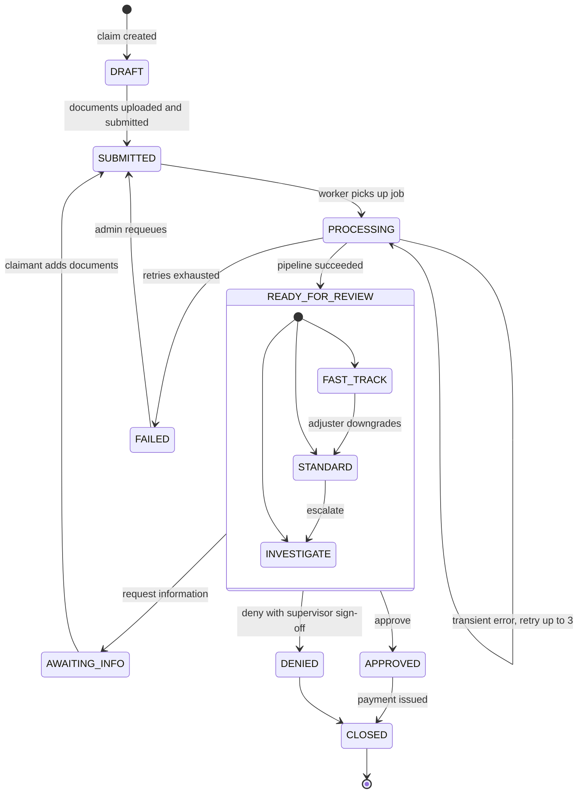

# Claim lifecycle (state machine)

```mermaid
stateDiagram-v2
    [*] --> DRAFT: claim created
    DRAFT --> SUBMITTED: documents uploaded and submitted
    SUBMITTED --> PROCESSING: worker picks up job
    PROCESSING --> PROCESSING: transient error, retry up to 3
    PROCESSING --> READY_FOR_REVIEW: pipeline succeeded
    PROCESSING --> FAILED: retries exhausted
    FAILED --> SUBMITTED: admin requeues

    state READY_FOR_REVIEW {
        [*] --> FAST_TRACK
        [*] --> STANDARD
        [*] --> INVESTIGATE
        FAST_TRACK --> STANDARD: adjuster downgrades
        STANDARD --> INVESTIGATE: escalate
    }

    READY_FOR_REVIEW --> AWAITING_INFO: request information
    AWAITING_INFO --> SUBMITTED: claimant adds documents
    READY_FOR_REVIEW --> APPROVED: approve
    READY_FOR_REVIEW --> DENIED: deny with supervisor sign-off
    APPROVED --> CLOSED: payment issued
    DENIED --> CLOSED
    CLOSED --> [*]
```
