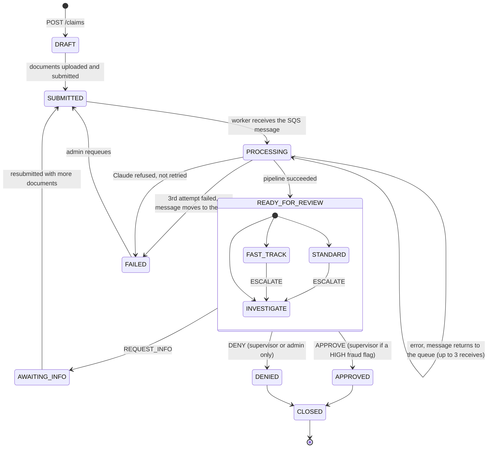

# Claim lifecycle (state machine)

```mermaid
stateDiagram-v2
    [*] --> DRAFT: POST /claims
    DRAFT --> SUBMITTED: documents uploaded and submitted
    SUBMITTED --> PROCESSING: worker receives the SQS message
    PROCESSING --> PROCESSING: error, message returns to the queue (up to 3 receives)
    PROCESSING --> READY_FOR_REVIEW: pipeline succeeded
    PROCESSING --> FAILED: 3rd attempt failed, message moves to the DLQ
    PROCESSING --> FAILED: Claude refused, not retried
    FAILED --> SUBMITTED: admin requeues

    state READY_FOR_REVIEW {
        [*] --> FAST_TRACK
        [*] --> STANDARD
        [*] --> INVESTIGATE
        FAST_TRACK --> INVESTIGATE: ESCALATE
        STANDARD --> INVESTIGATE: ESCALATE
    }

    READY_FOR_REVIEW --> AWAITING_INFO: REQUEST_INFO
    AWAITING_INFO --> SUBMITTED: resubmitted with more documents
    READY_FOR_REVIEW --> APPROVED: APPROVE (supervisor if a HIGH fraud flag)
    READY_FOR_REVIEW --> DENIED: DENY (supervisor or admin only)
    APPROVED --> CLOSED
    DENIED --> CLOSED
    CLOSED --> [*]
```

`CLOSED` is reserved for a downstream payments system and is not set by ClaimLens today. Every transition writes an `audit_events` row.
