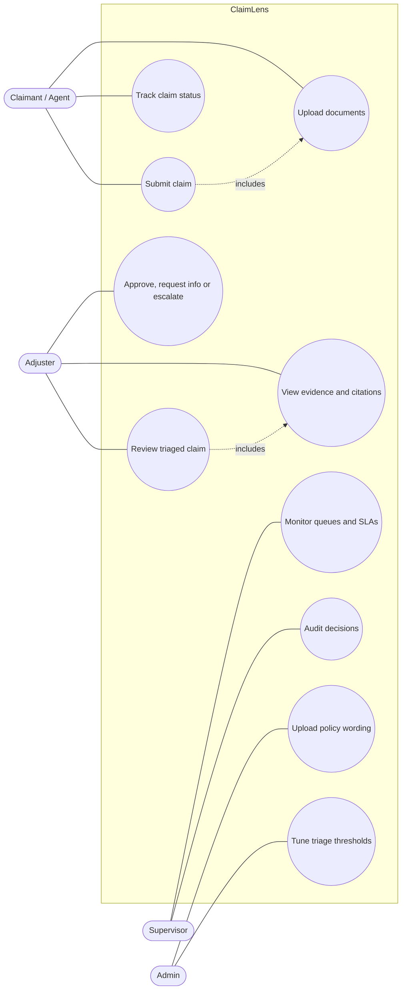

# Use cases

```mermaid
flowchart LR
    Claimant([Claimant / Agent])
    Adjuster([Adjuster])
    Supervisor([Supervisor])
    Admin([Admin])

    subgraph ClaimLens
        UC1((Submit claim))
        UC2((Upload documents))
        UC3((Track claim status))
        UC4((Review triaged claim))
        UC5((Approve, request info or escalate))
        UC6((View evidence and citations))
        UC7((Monitor queues and SLAs))
        UC8((Audit decisions))
        UC9((Upload policy wording))
        UC10((Tune triage thresholds))
    end

    Claimant --- UC1
    Claimant --- UC2
    Claimant --- UC3
    Adjuster --- UC4
    Adjuster --- UC5
    Adjuster --- UC6
    Supervisor --- UC7
    Supervisor --- UC8
    Admin --- UC9
    Admin --- UC10
    UC1 -. includes .-> UC2
    UC4 -. includes .-> UC6
```
